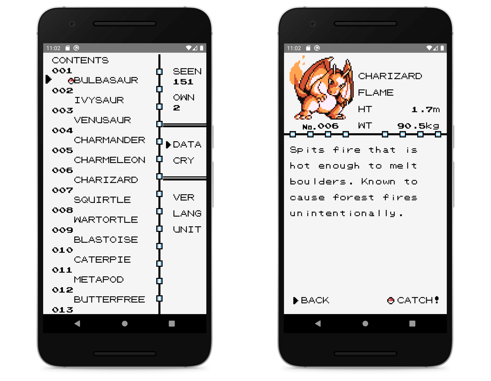

<h1 align="center">
    Retrodex
</h1>
    

  <strong>Pokedex from Pokémon Game Boy versions</strong> 
  With <a href="https://facebook.github.io/react-native/">React Native</a>

## 📱 Overview

Retrodex is a simple offline retro pokedex. The goal of this project is to re-create the Pokedex from Pokémon Red, Blue and Yellow versions released in the 90's. Sprites, sounds and user experience aim to match original games.

## 🤓 Motivations

Fun! And also because I grew up with this addictive game, like most of the people of my generation. Moreover, I wanted to make a first step into React Native with a simple and nostalgic app to pay a tribute to this incredible game!

## 🚀 Deployment

> Fully functionnal on iOS but not deployed yet 💸

## 🔗 Dependencies

- [React](https://github.com/facebook/react)
- [React Native](https://github.com/facebook/react-native)
- [React Native Gesture Handler](https://github.com/kmagiera/react-native-gesture-handler)
- [React Navigation](https://github.com/react-navigation/react-navigation)
- [react-native-sound](https://github.com/zmxv/react-native-sound)

## 🙏 Thanks to...

- Pascal Pixel for [pokemon-fonts](https://github.com/Superpencil/pokemon-font/)
- Jalyna for [oakdex](https://github.com/jalyna/oakdex-pokedex), that serves me as a base for the Pokédex

## 🤝 Contributing

I'd be happy to get your contribution on this project! Feel free to fork this repo and submit a PR.
